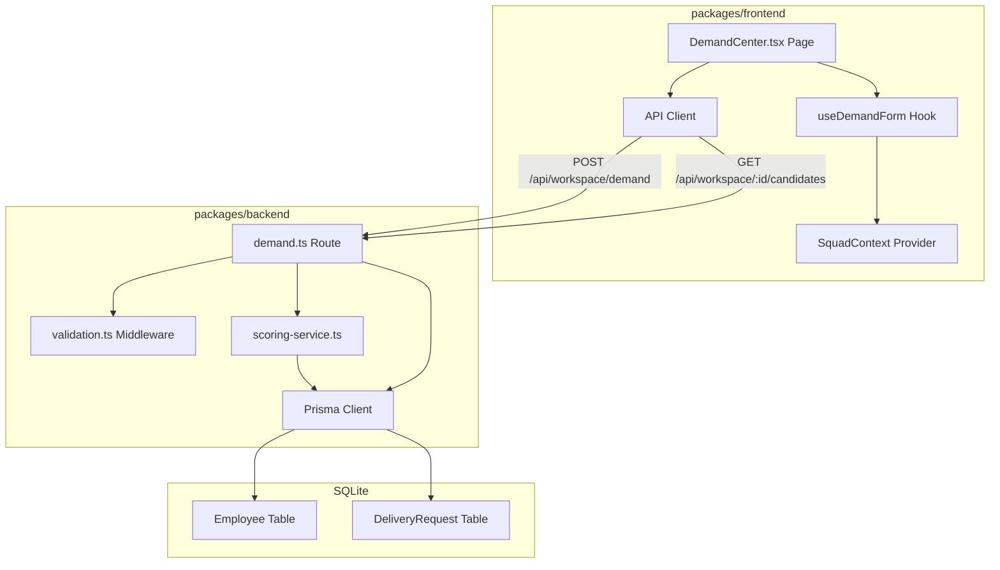
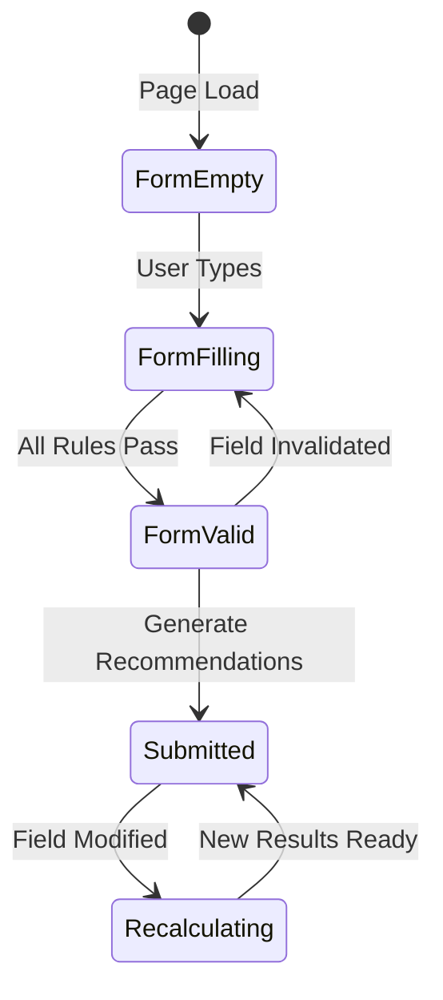
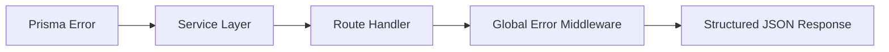

# DESIGN — Feature 5: Demand & Search Workspace

## Overview

The Demand & Search Workspace is the entry point for the SquadForge user journey. It provides a form-based interface for delivery leads to capture a delivery need (demand criteria) and trigger a rules-based scoring engine that ranks mock candidates by suitability. The workspace stores active demand criteria in session state and presents ranked results in real time as inputs change.

### Key Design Decisions

| Decision | Choice | Rationale |
|----------|--------|-----------|
| Form state management | `useReducer` in a custom `useDemandForm` hook | Complex form with multiple validation rules benefits from reducer pattern over individual `useState` calls |
| Validation library | Zod (shared schema between frontend and backend) | Type-safe runtime validation, consistent error messages, reuse across client/server |
| Real-time recalculation | Debounced (300ms) API call on field change | Prevents excessive scoring calls while maintaining responsive feel |
| Session persistence | React Context (`SquadContext`) | Keeps demand criteria available across navigation without backend session management |
| Scoring execution | Backend service (pure functions) | Deterministic, testable, separates UI from business logic |
| Mock data source | Seeded SQLite via Prisma | Consistent with architecture; enables realistic query patterns |

---

## Architecture



### Request Flow

1. User fills out the demand form in `DemandCenter.tsx`
2. `useDemandForm` hook manages field state and validation via Zod
3. On submit, the API client POSTs to `/api/workspace/demand`
4. Backend validates with Zod, persists the `DeliveryRequest`, triggers scoring
5. `scoring-service.ts` loads all employees, calculates scores, ranks them
6. Response returns `demandId` + status; frontend navigates to candidate list
7. On field changes (after initial submission), debounced recalculation re-fetches ranked candidates

### Session State Flow



---

## Components and Interfaces

### Frontend Components

#### DemandCenter Page (`packages/frontend/src/pages/DemandCenter.tsx`)

Top-level page component. Renders the demand capture form and delegates state to `useDemandForm`.

```ts
// Renders form fields, validation errors, submit button
// On submit: calls API, stores demandId in context, navigates to candidates
```

#### useDemandForm Hook (`packages/frontend/src/hooks/useDemandForm.ts`)

```ts
interface UseDemandFormReturn {
  fields: DemandFormFields;
  errors: Partial<Record<keyof DemandFormFields, string>>;
  isValid: boolean;
  isSubmitting: boolean;
  updateField: <K extends keyof DemandFormFields>(key: K, value: DemandFormFields[K]) => void;
  addSkill: (skill: string) => void;
  removeSkill: (skill: string) => void;
  submit: () => Promise<{ demandId: string } | null>;
  reset: () => void;
}
```

#### SquadContext (`packages/frontend/src/context/SquadContext.tsx`)

```ts
interface SquadForgeState {
  demandId: string | null;
  demandCriteria: DemandCriteria | null;
  candidateList: ScoredCandidate[];
  isLoading: boolean;
  sortOrder: 'suitability' | 'availability';
  expandedBreakdown: string | null;
  squad: ScoredCandidate[];
}

type SquadAction =
  | { type: 'SET_DEMAND'; payload: { demandId: string; criteria: DemandCriteria } }
  | { type: 'SET_CANDIDATES'; payload: ScoredCandidate[] }
  | { type: 'SET_LOADING'; payload: boolean }
  | { type: 'RESET' };
```

#### API Client (`packages/frontend/src/api/client.ts`)

```ts
export const submitDemand = async (criteria: DemandCriteria): Promise<{ demandId: string }> => { ... };
export const fetchCandidates = async (demandId: string): Promise<ScoredCandidate[]> => { ... };
```

### Backend Components

#### Demand Route (`packages/backend/src/routes/demand.ts`)

| Method | Path | Handler | Description |
|--------|------|---------|-------------|
| POST | `/api/workspace/demand` | `createDemand` | Validate, persist, trigger scoring |
| GET | `/api/workspace/:demandId/candidates` | `getCandidates` | Return ranked candidate list |
| GET | `/api/workspace/:demandId/candidates/:id/breakdown` | `getBreakdown` | Return score details for one candidate |

#### Scoring Service (`packages/backend/src/services/scoring-service.ts`)

Pure functions with no side effects:

```ts
export const calculateSkillScore = (
  requiredSkills: string[],
  candidateSkills: { name: string; level: number }[],
): number => { ... };

export const calculateAvailabilityScore = (allocationPercentage: number): number => { ... };

export const calculateRoleScore = (requestedRole: string, candidateRole: string): number => { ... };

export const calculateTotalScore = (sSkill: number, sAvail: number, sRole: number): number => { ... };

export const rankCandidates = (
  criteria: DemandCriteria,
  employees: Employee[],
): ScoredCandidate[] => { ... };
```

#### Validation Middleware (`packages/backend/src/middleware/validation.ts`)

Zod schema validation applied before route handlers execute.

```ts
const DemandRequestSchema = z.object({
  squadIntent: z.string().min(1),
  projectCode: z.string().min(1),
  priorityLevel: z.enum(['High', 'Medium', 'Low']),
  requiredRole: z.string().min(1),
  requiredSkills: z.array(z.string()).min(1),
  expectedDurationWeeks: z.number().positive(),
  businessDomain: z.string().min(1),
});
```

---

## Data Models

### Prisma Schema Additions

```prisma
model Employee {
  id                          String   @id @default(uuid())
  name                        String
  primaryRole                 String
  skills                      String   // JSON: [{ name: string, level: number }]
  currentAllocationPercentage Int      @default(0)
  businessDomain              String
  createdAt                   DateTime @default(now())
  updatedAt                   DateTime @updatedAt
}

model DeliveryRequest {
  id                    String   @id @default(uuid())
  squadIntent           String
  projectCode           String
  priorityLevel         String
  requiredRole          String
  requiredSkills        String   // JSON: string[]
  expectedDurationWeeks Int
  businessDomain        String
  createdAt             DateTime @default(now())
  updatedAt             DateTime @updatedAt
}
```

### TypeScript Interfaces (shared types)

```ts
interface DemandCriteria {
  squadIntent: string;
  projectCode: string;
  priorityLevel: 'High' | 'Medium' | 'Low';
  requiredRole: string;
  requiredSkills: string[];
  expectedDurationWeeks: number;
  businessDomain: string;
}

interface Employee {
  id: string;
  name: string;
  primaryRole: string;
  skills: { name: string; level: number }[];
  currentAllocationPercentage: number;
  businessDomain: string;
}

interface ScoredCandidate {
  candidateId: string;
  name: string;
  primaryRole: string;
  skills: { name: string; level: number }[];
  currentAllocationPercentage: number;
  availabilityLabel: 'Available Now' | 'Partial Capacity' | 'Limited Capacity';
  sSkill: number;
  sAvail: number;
  sRole: number;
  sTotal: number;
}

interface DemandFormFields {
  squadIntent: string;
  projectCode: string;
  priorityLevel: string;
  requiredRole: string;
  requiredSkills: string[];
  expectedDurationWeeks: number;
  businessDomain: string;
}
```

### Derived Values

| Field | Derivation |
|-------|-----------|
| `availabilityLabel` | 0% → "Available Now", 1–50% → "Partial Capacity", >50% → "Limited Capacity" |
| `sSkill` | Average of per-skill scores: not found → 0, level < 4 → 80, level ≥ 4 → 100 |
| `sAvail` | 0% → 100, 1–50% → 70, >50% → 20 |
| `sRole` | Exact match → 100, no match → 0 |
| `sTotal` | `(0.50 × sSkill) + (0.30 × sAvail) + (0.20 × sRole)` rounded to 2 decimals |


---

## Correctness Properties

*A property is a characteristic or behavior that should hold true across all valid executions of a system — essentially, a formal statement about what the system should do. Properties serve as the bridge between human-readable specifications and machine-verifiable correctness guarantees.*

### Property 1: Total Score is Weighted Sum of Sub-Scores

*For any* employee and any valid demand criteria, the total suitability score (`sTotal`) SHALL equal `(0.50 × sSkill) + (0.30 × sAvail) + (0.20 × sRole)` rounded to 2 decimal places, where each sub-score is independently calculated from the employee's attributes.

**Validates: Requirements 5.3**

### Property 2: Candidate Ranking is Descending by Total Score

*For any* set of employees scored against valid demand criteria, the resulting ranked candidate list SHALL be sorted in descending order by `sTotal` — that is, for every adjacent pair `(candidates[i], candidates[i+1])`, `candidates[i].sTotal >= candidates[i+1].sTotal`.

**Validates: Requirements 5.3, 5.4**

### Property 3: Validation Rejects Incomplete Demand Forms

*For any* demand form submission where at least one required field (requiredRole, requiredSkills, projectCode) is missing or empty, the validation SHALL reject the submission and no scoring SHALL be triggered.

**Validates: Requirements 5.6, 5.7, 5.8**

### Property 4: Demand Criteria Round-Trip Persistence

*For any* valid demand criteria that is submitted through the API, retrieving the stored delivery request SHALL return criteria with identical field values to what was submitted.

**Validates: Requirements 5.9**

### Property 5: All Individual Scores are Bounded [0, 100]

*For any* employee and any valid demand criteria, each individual score component (sSkill, sAvail, sRole) and the total score (sTotal) SHALL be within the range [0, 100] inclusive.

**Validates: Requirements 5.3**

---

## Error Handling

### Frontend Errors

| Scenario | Handling | User Feedback |
|----------|----------|---------------|
| Validation failure (missing fields) | Prevent submission, show inline errors below fields | Red text error messages per field |
| Network error (API unreachable) | Catch in API client, propagate to UI | Toast notification: "Unable to connect. Please try again." |
| Server 400 (validation failed) | Parse error response, map to field errors | Inline field errors matching server validation |
| Server 404 (demand not found) | Redirect to demand form | Toast: "Demand not found. Please create a new request." |
| Server 500 (unexpected) | Caught by Error Boundary | Fallback UI with "Something went wrong" message |

### Backend Errors

| Scenario | HTTP Status | Error Code | Response |
|----------|------------|------------|----------|
| Missing/invalid request body fields | 400 | `VALIDATION_FAILED` | `{ error: { code: "VALIDATION_FAILED", message: "<Zod error details>" } }` |
| Demand ID not found | 404 | `NOT_FOUND` | `{ error: { code: "NOT_FOUND", message: "Demand not found" } }` |
| Candidate ID not found | 404 | `NOT_FOUND` | `{ error: { code: "NOT_FOUND", message: "Candidate not found" } }` |
| Database error | 500 | `INTERNAL_ERROR` | `{ error: { code: "INTERNAL_ERROR", message: "An unexpected error occurred" } }` |

### Error Propagation



All errors propagate to the global error handler middleware (`packages/backend/src/middleware/errorHandler.ts`) which formats them into the standard `{ error: { code, message } }` envelope.

---

## Testing Strategy

### Unit Tests (Vitest)

| Component | What to Test | Approach |
|-----------|-------------|----------|
| `scoring-service.ts` | Score calculation correctness | Property-based tests for all 5 properties + example-based for specific known values |
| `useDemandForm.ts` | Validation logic, state transitions | Property-based test for Property 3 (validation rejection) + examples for field updates |
| Zod schemas | Schema validation accepts valid / rejects invalid | Property-based test for validation properties |
| `generate-reason.ts` | Reason text generation | Example-based tests with known score inputs |
| API client functions | Request/response mapping | Example-based with mocked fetch |

### Property-Based Tests (Vitest + fast-check)

The project will use **fast-check** as the property-based testing library for Vitest.

**Configuration:**
- Minimum 100 iterations per property test (`{ numRuns: 100 }`)
- Each property test references its design document property via tag comment

**Property test implementation plan:**

```ts
// Feature: feature-5-demand-search-workspace, Property 1: Total Score is Weighted Sum of Sub-Scores
fc.assert(fc.property(
  arbDemandCriteria(),
  arbEmployee(),
  (criteria, employee) => {
    const sSkill = calculateSkillScore(criteria.requiredSkills, employee.skills);
    const sAvail = calculateAvailabilityScore(employee.currentAllocationPercentage);
    const sRole = calculateRoleScore(criteria.requiredRole, employee.primaryRole);
    const expected = Math.round(((0.5 * sSkill) + (0.3 * sAvail) + (0.2 * sRole)) * 100) / 100;
    expect(calculateTotalScore(sSkill, sAvail, sRole)).toBe(expected);
  }
), { numRuns: 100 });
```

### Integration Tests

| Test | What to Verify |
|------|---------------|
| POST `/api/workspace/demand` | Creates delivery request, returns demandId |
| GET `/api/workspace/:id/candidates` | Returns correctly scored and ranked candidates |
| Demand → Candidates flow | End-to-end scoring pipeline with seeded data |

### E2E Tests (Playwright)

| Test | Journey |
|------|---------|
| Demand form submission | Fill form → click Generate → verify navigation to candidates page |
| Validation errors | Submit with missing fields → verify inline error messages |
| Real-time recalculation | Change skill after submission → verify candidates reorder |

### Test File Locations

```
packages/backend/src/services/scoring-service.test.ts    ← Property tests (Properties 1, 2, 5)
packages/backend/src/routes/demand.test.ts               ← Integration tests (Property 4)
packages/backend/src/middleware/validation.test.ts       ← Property test (Property 3)
packages/frontend/src/hooks/useDemandForm.test.ts        ← Unit tests for form hook
packages/frontend/e2e/demand-center.spec.ts              ← E2E tests
```
