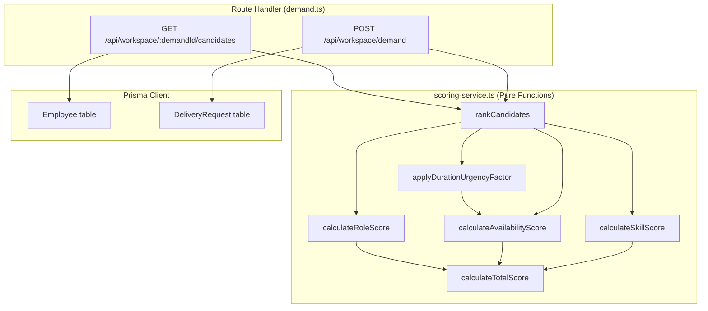

# DESIGN — Feature 6: Matchmaking & Scoring Engine

## Overview

The Matchmaking & Scoring Engine is a pure business logic service that ranks candidate employees against a delivery need using deterministic, rules-based weighted scoring. It receives demand criteria (required skills, role, duration, urgency) and a set of employee profiles, then produces a ranked list of scored candidates.

### Key Design Decisions

| Decision | Choice | Rationale |
|----------|--------|-----------|
| Architecture | Pure function service layer | No side effects, maximum testability, easy to reason about |
| Scoring approach | Rules-based weighted arithmetic | Deterministic, transparent, no AI/ML dependencies |
| Duration/urgency handling | Multiplier on availability score | Longer durations and higher urgency weight availability more heavily |
| Sub-score granularity | Three independent scoring dimensions | Skill (50%), Availability (30%), Role (20%) — each independently testable |
| Rounding | 2 decimal places on final score | Consistent precision for display and comparison |
| Data access | Receives data as function arguments | Service has no direct DB dependency — caller fetches and passes data |

---

## Architecture



### Scoring Pipeline Flow

```mermaid
flowchart LR
    A[DemandCriteria + Employee[]] --> B[Per-Employee Scoring]
    B --> C1[calculateSkillScore]
    B --> C2[calculateAvailabilityScore]
    B --> C3[calculateRoleScore]
    C2 --> D[applyDurationUrgencyFactor]
    C1 --> E[calculateTotalScore]
    D --> E
    C3 --> E
    E --> F[Sort descending by sTotal]
    F --> G[ScoredCandidate[]]
```

### Separation of Concerns

The scoring engine is intentionally decoupled from data access:

1. **Route handler** fetches employees from DB via Prisma, constructs `DemandCriteria`
2. **Scoring service** receives data as arguments, computes scores, returns results
3. **Route handler** formats and returns the API response

This means the scoring service can be tested with zero mocking — just pass in data and assert on output.

---

## Components and Interfaces

### Scoring Service (`packages/backend/src/services/scoring-service.ts`)

All exported functions are **pure** — no side effects, no I/O, no mutation of inputs.

```ts
/**
 * Calculate the skill match score for a candidate against required skills.
 * Returns the average of individual skill scores (0-100).
 */
export const calculateSkillScore = (
  requiredSkills: string[],
  candidateSkills: { name: string; level: number }[],
): number => { ... };

/**
 * Calculate raw availability score based on current allocation percentage.
 * Returns exactly 100, 70, or 20.
 */
export const calculateAvailabilityScore = (
  allocationPercentage: number,
): number => { ... };

/**
 * Apply duration and urgency adjustments to the availability score.
 * Longer durations and higher urgency amplify the availability weight.
 * Returns an adjusted availability score in [0, 100].
 */
export const applyDurationUrgencyFactor = (
  rawAvailScore: number,
  expectedDurationWeeks: number,
  priorityLevel: 'High' | 'Medium' | 'Low',
): number => { ... };

/**
 * Calculate role alignment score.
 * Returns 100 for exact match, 0 otherwise.
 */
export const calculateRoleScore = (
  requestedRole: string,
  candidateRole: string,
): number => { ... };

/**
 * Calculate the weighted total score from sub-scores.
 * Formula: S_Total = (0.50 × sSkill) + (0.30 × sAvail) + (0.20 × sRole)
 * Rounded to 2 decimal places.
 */
export const calculateTotalScore = (
  sSkill: number,
  sAvail: number,
  sRole: number,
): number => { ... };

/**
 * Score and rank all candidates against demand criteria.
 * Returns candidates sorted descending by sTotal.
 */
export const rankCandidates = (
  criteria: DemandCriteria,
  employees: Employee[],
): ScoredCandidate[] => { ... };
```

### Internal Helper (not exported)

```ts
/**
 * Score a single skill requirement against a candidate's skills.
 * Returns 0 (missing), 80 (level < 4), or 100 (level >= 4).
 */
const scoreIndividualSkill = (
  skillName: string,
  candidateSkills: { name: string; level: number }[],
): number => { ... };
```

### Duration & Urgency Factor Design

REQ-6.11 requires that duration and urgency factor into scoring. The design applies a multiplier to the **availability score** because:

- Longer projects need sustained availability — a partially allocated person is riskier for a 12-week engagement than a 2-week one
- Higher urgency means the person needs to be available *now*, not just eventually

**Urgency multiplier table:**

| Priority Level | Duration ≤ 4 weeks | Duration 5-8 weeks | Duration > 8 weeks |
|---------------|--------------------|--------------------|---------------------|
| Low           | 1.0                | 1.0                | 1.05                |
| Medium        | 1.0                | 1.05               | 1.10                |
| High          | 1.05               | 1.10               | 1.15                |

The multiplier is applied to the raw availability score, then clamped to [0, 100]:

```
adjustedAvail = clamp(rawAvailScore × urgencyMultiplier, 0, 100)
```

This means candidates who are fully available (score 100) get a slight boost for urgent/long projects, while heavily allocated candidates (score 20) remain low regardless.

---

## Data Models

### Input Types (from `packages/shared/src/types.ts`)

```ts
interface DemandCriteria {
  squadIntent: string;
  projectCode: string;
  priorityLevel: 'High' | 'Medium' | 'Low';
  requiredRole: string;
  requiredSkills: string[];
  expectedDurationWeeks: number;
  businessDomain: string;
}

interface Employee {
  id: string;
  name: string;
  primaryRole: string;
  skills: { name: string; level: number }[];
  currentAllocationPercentage: number;
  businessDomain: string;
}
```

### Output Types

```ts
interface ScoredCandidate {
  candidateId: string;
  name: string;
  primaryRole: string;
  skills: { name: string; level: number }[];
  currentAllocationPercentage: number;
  availabilityLabel: 'Available Now' | 'Partial Capacity' | 'Limited Capacity';
  sSkill: number;
  sAvail: number;
  sRole: number;
  sTotal: number;
}
```

### Derived Values

| Field | Derivation |
|-------|-----------|
| `availabilityLabel` | 0% → "Available Now", 1–50% → "Partial Capacity", >50% → "Limited Capacity" |
| `sSkill` | Average of per-skill scores: not found → 0, level < 4 → 80, level ≥ 4 → 100 |
| `sAvail` | Raw band score (100/70/20) adjusted by duration/urgency multiplier, clamped [0,100] |
| `sRole` | Exact match → 100, no match → 0 |
| `sTotal` | `(0.50 × sSkill) + (0.30 × sAvail) + (0.20 × sRole)` rounded to 2 decimals |

### Score Ranges

| Sub-Score | Possible Values |
|-----------|----------------|
| Individual skill score | 0, 80, 100 |
| `sSkill` (average) | [0, 100] continuous |
| Raw `sAvail` | 20, 70, 100 |
| Adjusted `sAvail` | [0, 100] continuous (after multiplier + clamp) |
| `sRole` | 0, 100 |
| `sTotal` | [0, 100] continuous |

---

## Correctness Properties

*A property is a characteristic or behavior that should hold true across all valid executions of a system — essentially, a formal statement about what the system should do. Properties serve as the bridge between human-readable specifications and machine-verifiable correctness guarantees.*

### Property 1: Total Score is Weighted Sum of Sub-Scores

*For any* three sub-scores sSkill, sAvail, and sRole each in [0, 100], `calculateTotalScore(sSkill, sAvail, sRole)` SHALL equal `Math.round(((0.50 × sSkill) + (0.30 × sAvail) + (0.20 × sRole)) * 100) / 100`.

**Validates: Requirements 6.2**

### Property 2: Individual Skill Score Classification

*For any* required skill name and candidate skills array, the individual skill score SHALL be exactly 0 if the skill is not found in the candidate's skills, exactly 80 if the skill is found with level < 4, and exactly 100 if the skill is found with level ≥ 4.

**Validates: Requirements 6.4, 6.5, 6.6**

### Property 3: Skill Score is Arithmetic Mean of Individual Scores

*For any* non-empty list of required skills and any candidate skills array, `calculateSkillScore` SHALL return the arithmetic mean of the individual skill scores (each being 0, 80, or 100).

**Validates: Requirements 6.3**

### Property 4: Availability Score Band Mapping

*For any* allocation percentage in [0, 100], `calculateAvailabilityScore` SHALL return exactly 100 when allocation is 0, exactly 70 when allocation is in [1, 50], and exactly 20 when allocation is in [51, 100].

**Validates: Requirements 6.7, 6.8, 6.9**

### Property 5: Role Score Binary Classification

*For any* two role strings, `calculateRoleScore` SHALL return exactly 100 when the strings are identical and exactly 0 when they differ.

**Validates: Requirements 6.10**

### Property 6: All Scores Bounded in [0, 100]

*For any* valid demand criteria and employee profile, all computed scores (sSkill, sAvail, sRole, sTotal) SHALL be within the inclusive range [0, 100].

**Validates: Requirements 6.1, 6.2**

---

## Error Handling

### Input Validation (handled by caller/route layer)

| Scenario | Handling | Behavior |
|----------|----------|----------|
| Empty `requiredSkills` array | `calculateSkillScore` returns 0 | Defensive: no division by zero, treated as no skill match |
| Negative allocation percentage | Treated as 0 (clamp to valid range) | Defensive: invalid data shouldn't crash scoring |
| Allocation > 100 | Treated as 100 (clamp to valid range) | Defensive: cap at maximum |
| Skill level outside [1, 5] | Still applies < 4 / >= 4 rule | Rule applies regardless of unexpected levels |
| Empty employee list | `rankCandidates` returns empty array | No candidates to score |

### Error Propagation

The scoring service does NOT throw errors. As a pure function layer:
- It handles edge cases defensively with clamping and fallback values
- It always returns a valid result array (possibly empty)
- Validation of inputs (Zod) happens in the route handler layer before scoring is invoked

```ts
// Route handler is responsible for validation
const parsed = DemandRequestSchema.safeParse(req.body);
if (!parsed.success) {
  return res.status(400).json({
    error: { code: 'VALIDATION_FAILED', message: parsed.error.message },
  });
}

// Scoring service receives already-validated data
const candidates = rankCandidates(parsed.data, employees);
```

---

## Testing Strategy

### Unit Tests (Vitest — example-based)

| Function | What to Test | Approach |
|----------|-------------|----------|
| `scoreIndividualSkill` | Missing skill → 0, level 1-3 → 80, level 4-5 → 100 | Concrete examples for each branch |
| `calculateSkillScore` | Empty skills, single skill, multiple skills | Examples with known expected averages |
| `calculateAvailabilityScore` | Boundary values: 0, 1, 50, 51, 100 | One test per boundary |
| `applyDurationUrgencyFactor` | Each priority × duration combination | Table-driven tests covering multiplier matrix |
| `calculateRoleScore` | Exact match, case-sensitive mismatch | Pair of examples |
| `calculateTotalScore` | Known sub-score combinations | Verify weighted arithmetic |
| `rankCandidates` | Multiple employees, verify sort order | Integration of all sub-functions |

### Property-Based Tests (Vitest + fast-check)

The project uses **fast-check** as the property-based testing library.

**Configuration:**
- Minimum 100 iterations per property test (`{ numRuns: 100 }`)
- Each property test references its design document property via tag comment
- Tag format: **Feature: feature-6-matchmaking-scoring-engine, Property {N}: {title}**

**Property test implementation plan:**

```ts
import { describe, it, expect } from 'vitest';
import * as fc from 'fast-check';

// Feature: feature-6-matchmaking-scoring-engine, Property 1: Total Score is Weighted Sum of Sub-Scores
describe('Property 1: Total Score is Weighted Sum', () => {
  it('sTotal equals the weighted formula for any valid sub-scores', () => {
    fc.assert(fc.property(
      fc.float({ min: 0, max: 100, noNaN: true }),
      fc.float({ min: 0, max: 100, noNaN: true }),
      fc.float({ min: 0, max: 100, noNaN: true }),
      (sSkill, sAvail, sRole) => {
        const result = calculateTotalScore(sSkill, sAvail, sRole);
        const expected = Math.round(((0.5 * sSkill) + (0.3 * sAvail) + (0.2 * sRole)) * 100) / 100;
        expect(result).toBe(expected);
      }
    ), { numRuns: 100 });
  });
});

// Feature: feature-6-matchmaking-scoring-engine, Property 2: Individual Skill Score Classification
describe('Property 2: Individual Skill Score Classification', () => {
  it('missing skills score 0, level<4 scores 80, level>=4 scores 100', () => {
    fc.assert(fc.property(
      fc.string({ minLength: 1 }),                    // required skill name
      fc.array(fc.record({                            // candidate skills
        name: fc.string({ minLength: 1 }),
        level: fc.integer({ min: 1, max: 5 }),
      })),
      (requiredSkill, candidateSkills) => {
        const found = candidateSkills.find(s => s.name === requiredSkill);
        const score = scoreIndividualSkill(requiredSkill, candidateSkills);
        if (!found) expect(score).toBe(0);
        else if (found.level < 4) expect(score).toBe(80);
        else expect(score).toBe(100);
      }
    ), { numRuns: 100 });
  });
});

// Feature: feature-6-matchmaking-scoring-engine, Property 3: Skill Score is Arithmetic Mean
describe('Property 3: Skill Score is Arithmetic Mean', () => {
  it('sSkill is the average of individual skill scores', () => {
    fc.assert(fc.property(
      fc.array(fc.string({ minLength: 1 }), { minLength: 1, maxLength: 10 }),
      fc.array(fc.record({
        name: fc.string({ minLength: 1 }),
        level: fc.integer({ min: 1, max: 5 }),
      })),
      (requiredSkills, candidateSkills) => {
        const result = calculateSkillScore(requiredSkills, candidateSkills);
        const individualScores = requiredSkills.map(s => scoreIndividualSkill(s, candidateSkills));
        const expectedAvg = individualScores.reduce((a, b) => a + b, 0) / individualScores.length;
        expect(result).toBeCloseTo(expectedAvg, 10);
      }
    ), { numRuns: 100 });
  });
});

// Feature: feature-6-matchmaking-scoring-engine, Property 4: Availability Score Band Mapping
describe('Property 4: Availability Score Band Mapping', () => {
  it('allocation maps to correct band score', () => {
    fc.assert(fc.property(
      fc.integer({ min: 0, max: 100 }),
      (allocation) => {
        const score = calculateAvailabilityScore(allocation);
        if (allocation === 0) expect(score).toBe(100);
        else if (allocation <= 50) expect(score).toBe(70);
        else expect(score).toBe(20);
      }
    ), { numRuns: 100 });
  });
});

// Feature: feature-6-matchmaking-scoring-engine, Property 5: Role Score Binary Classification
describe('Property 5: Role Score Binary Classification', () => {
  it('identical roles score 100, different roles score 0', () => {
    fc.assert(fc.property(
      fc.string({ minLength: 1 }),
      fc.string({ minLength: 1 }),
      (requestedRole, candidateRole) => {
        const score = calculateRoleScore(requestedRole, candidateRole);
        if (requestedRole === candidateRole) expect(score).toBe(100);
        else expect(score).toBe(0);
      }
    ), { numRuns: 100 });
  });
});

// Feature: feature-6-matchmaking-scoring-engine, Property 6: All Scores Bounded [0, 100]
describe('Property 6: All Scores Bounded [0, 100]', () => {
  it('all computed scores are within [0, 100]', () => {
    fc.assert(fc.property(
      arbDemandCriteria(),
      arbEmployee(),
      (criteria, employee) => {
        const [candidate] = rankCandidates(criteria, [employee]);
        if (candidate) {
          expect(candidate.sSkill).toBeGreaterThanOrEqual(0);
          expect(candidate.sSkill).toBeLessThanOrEqual(100);
          expect(candidate.sAvail).toBeGreaterThanOrEqual(0);
          expect(candidate.sAvail).toBeLessThanOrEqual(100);
          expect(candidate.sRole).toBeGreaterThanOrEqual(0);
          expect(candidate.sRole).toBeLessThanOrEqual(100);
          expect(candidate.sTotal).toBeGreaterThanOrEqual(0);
          expect(candidate.sTotal).toBeLessThanOrEqual(100);
        }
      }
    ), { numRuns: 100 });
  });
});
```

### Test Generators (Arbitraries)

```ts
const arbEmployee = (): fc.Arbitrary<Employee> =>
  fc.record({
    id: fc.string({ minLength: 1 }),
    name: fc.string({ minLength: 1 }),
    primaryRole: fc.constantFrom('Frontend Engineer', 'Backend Engineer', 'Product Owner', 'QA Engineer', 'Architect'),
    skills: fc.array(fc.record({
      name: fc.constantFrom('React', 'Node', 'AWS', 'TypeScript', 'Python', 'Java', 'SQL'),
      level: fc.integer({ min: 1, max: 5 }),
    }), { minLength: 0, maxLength: 6 }),
    currentAllocationPercentage: fc.integer({ min: 0, max: 100 }),
    businessDomain: fc.constantFrom('Retail Banking', 'Insurance', 'Wealth Management'),
  });

const arbDemandCriteria = (): fc.Arbitrary<DemandCriteria> =>
  fc.record({
    squadIntent: fc.string({ minLength: 1 }),
    projectCode: fc.string({ minLength: 1 }),
    priorityLevel: fc.constantFrom('High', 'Medium', 'Low'),
    requiredRole: fc.constantFrom('Frontend Engineer', 'Backend Engineer', 'Product Owner', 'QA Engineer', 'Architect'),
    requiredSkills: fc.array(
      fc.constantFrom('React', 'Node', 'AWS', 'TypeScript', 'Python', 'Java', 'SQL'),
      { minLength: 1, maxLength: 5 },
    ),
    expectedDurationWeeks: fc.integer({ min: 1, max: 52 }),
    businessDomain: fc.constantFrom('Retail Banking', 'Insurance', 'Wealth Management'),
  });
```

### Test File Location

```
packages/backend/src/services/scoring-service.test.ts
```

All property tests and unit tests for the scoring engine live in a single co-located test file, organized by:
1. Property-based tests (Properties 1–6)
2. Example-based unit tests (boundary values, known calculations)
