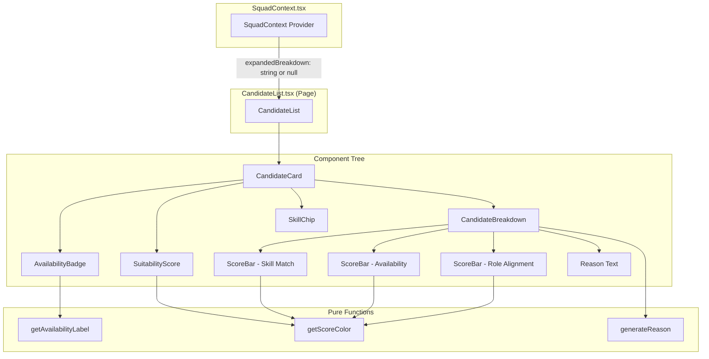
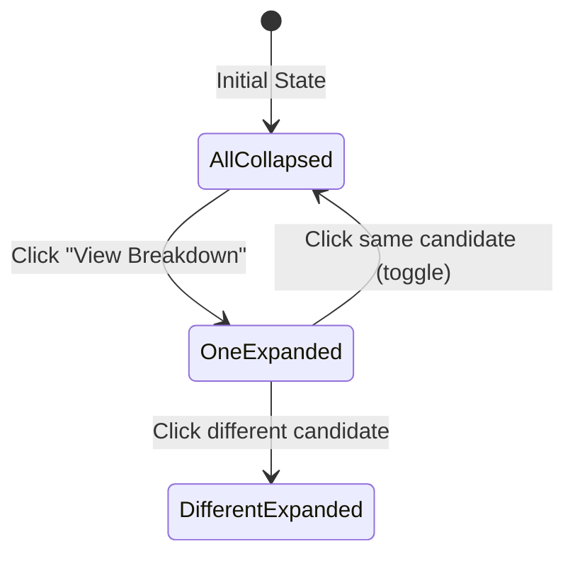

# DESIGN — Feature 7: Candidate Profile Breakdown

## Overview

The Candidate Profile Breakdown feature makes scoring recommendations transparent by displaying detailed candidate information, score breakdowns, and rule-based explanations. It transforms raw `ScoredCandidate` objects from the scoring engine (Feature 6) into an accessible, visual presentation that helps delivery leads understand *why* each candidate was ranked.

### Key Design Decisions

| Decision | Choice | Rationale |
|----------|--------|-----------|
| Component architecture | Small, single-responsibility components | Each visual element (badge, score, bar, chip) is independently testable and reusable |
| Expand/collapse state | Local `useState` per card + context for single-open | Simple state; SquadContext tracks which breakdown is expanded to ensure only one is open at a time |
| Reason generation | Pure function with deterministic rules | Testable, transparent, no AI/ML — matches project constraints |
| Score color mapping | Threshold-based (≥80 green, ≥60 amber, <60 red) | Consistent visual language across all scoring components |
| Accessibility | aria-labels + text labels on all visual indicators | Color alone is never sufficient per WCAG and project conventions |
| Styling | Tailwind utility classes exclusively | Only exception: dynamic `style={{ width }}` for progress bar fills |

---

## Architecture



### Data Flow

```mermaid
flowchart LR
    A[API: GET /api/workspace/:demandId/candidates] --> B[ScoredCandidate[]]
    B --> C[SquadContext stores candidateList]
    C --> D[CandidateList maps over candidates]
    D --> E[CandidateCard receives single ScoredCandidate]
    E --> F[Sub-components render score visuals]
    E --> G[CandidateBreakdown shows details on expand]
    G --> H[generateReason produces explanation]
```

### Expand/Collapse Behavior

Only one candidate breakdown can be open at a time (accordion pattern). The `expandedBreakdown` field in `SquadContext` holds the `candidateId` of the currently expanded card, or `null` if all are collapsed.



---

## Components and Interfaces

### CandidateCard (`packages/frontend/src/components/CandidateCard.tsx`)

The top-level card component that displays a candidate's summary and optionally their breakdown.

```ts
interface CandidateCardProps {
  candidate: ScoredCandidate;
  isExpanded: boolean;
  isAssigned: boolean;
  onToggleBreakdown: (candidateId: string) => void;
  onAssign: (candidateId: string) => void;
}

export const CandidateCard: ({ candidate, isExpanded, isAssigned, onToggleBreakdown, onAssign }: CandidateCardProps) => JSX.Element;
```

**Responsibilities:**
- Renders avatar, name, role, availability badge, skills, total score
- Delegates breakdown display to `CandidateBreakdown` when expanded
- Handles keyboard interaction (Enter/Space to toggle breakdown)

### CandidateBreakdown (`packages/frontend/src/components/CandidateBreakdown.tsx`)

Expandable panel showing score details and explanation.

```ts
interface CandidateBreakdownProps {
  sSkill: number;
  sAvail: number;
  sRole: number;
  sTotal: number;
  currentAllocationPercentage: number;
}

export const CandidateBreakdown: ({ sSkill, sAvail, sRole, sTotal, currentAllocationPercentage }: CandidateBreakdownProps) => JSX.Element;
```

**Responsibilities:**
- Renders three `ScoreBar` components (Skill Match, Availability, Role Alignment)
- Displays total score prominently
- Calls `generateReason` and renders the explanation text

### AvailabilityBadge (`packages/frontend/src/components/AvailabilityBadge.tsx`)

Badge indicating candidate availability based on allocation percentage.

```ts
interface AvailabilityBadgeProps {
  allocation: number;
}

export const AvailabilityBadge: ({ allocation }: AvailabilityBadgeProps) => JSX.Element;
```

**Mapping rules:**

| Allocation | Label | Tailwind Classes |
|------------|-------|-----------------|
| 0% | Available Now | `bg-green-100 text-green-700 text-xs px-2 py-0.5 rounded-full` |
| 1–50% | Partial Capacity | `bg-yellow-100 text-yellow-700 text-xs px-2 py-0.5 rounded-full` |
| > 50% | Limited Capacity | `bg-orange-100 text-orange-700 text-xs px-2 py-0.5 rounded-full` |

### SuitabilityScore (`packages/frontend/src/components/SuitabilityScore.tsx`)

Large numeric score display with color coding.

```ts
interface SuitabilityScoreProps {
  value: number;
}

export const SuitabilityScore: ({ value }: SuitabilityScoreProps) => JSX.Element;
```

**Color rules:**
- `value >= 80` → `text-green-600`
- `value >= 60` → `text-amber-600`
- `value < 60` → `text-red-600`

Must include `aria-label={`Suitability score: ${value} percent`}`.

### ScoreBar (`packages/frontend/src/components/ScoreBar.tsx`)

Progress bar visualizing a single score dimension.

```ts
interface ScoreBarProps {
  label: string;
  value: number;
  max: number; // always 100
}

export const ScoreBar: ({ label, value, max }: ScoreBarProps) => JSX.Element;
```

**Visual specification:**
- Track: `h-2 bg-slate-200 rounded-full`
- Fill width: `style={{ width: `${(value / max) * 100}%` }}`
- Fill color: same threshold rules as SuitabilityScore (green ≥ 80, amber ≥ 60, red < 60)
- Must include `aria-label={`${label}: ${value} out of ${max}`}`
- Displays numeric value as text beside the bar

### SkillChip (`packages/frontend/src/components/SkillChip.tsx`)

Compact tag for displaying a candidate's skill with level.

```ts
interface SkillChipProps {
  name: string;
  level: number;
}

export const SkillChip: ({ name, level }: SkillChipProps) => JSX.Element;
```

Renders as: `bg-slate-100 text-slate-700 rounded-full px-3 py-1 text-xs`
Content: `{name} (L{level})`

### Utility Functions

#### `generateReason` (`packages/frontend/src/utils/generate-reason.ts`)

Pure function that produces a rule-based explanation string from scores.

```ts
export const generateReason = (
  sSkill: number,
  sAvail: number,
  sRole: number,
  allocation: number,
): string;
```

**Rules:**
1. Skill assessment: `sSkill >= 80` → "Strong skill alignment" | `sSkill >= 50` → "Moderate skill match" | else → "Weak skill match"
2. Availability: `sAvail === 100` → "fully available" | `sAvail === 70` → `"good availability (${allocation}% allocated)"` | else → `"limited availability (${allocation}% allocated)"`
3. Role: `sRole === 100` → "exact role match" | else → "role mismatch"
4. Join with ", " and append "."

**Output example:** `"Strong skill alignment, good availability (40% allocated), exact role match."`

#### `getScoreColor` (`packages/frontend/src/utils/generate-reason.ts`)

Helper for determining Tailwind color class from a score value.

```ts
export const getScoreColor = (value: number): string;
```

Returns: `'text-green-600'` if ≥ 80, `'text-amber-600'` if ≥ 60, `'text-red-600'` if < 60.

#### `getScoreBarColor` (`packages/frontend/src/utils/generate-reason.ts`)

Helper for determining the bar fill color class.

```ts
export const getScoreBarColor = (value: number): string;
```

Returns: `'bg-green-500'` if ≥ 80, `'bg-amber-500'` if ≥ 60, `'bg-red-500'` if < 60.

#### `getAvailabilityLabel` (`packages/frontend/src/utils/generate-reason.ts`)

Pure function that maps allocation to label and styling.

```ts
interface AvailabilityInfo {
  label: string;
  className: string;
}

export const getAvailabilityLabel = (allocation: number): AvailabilityInfo;
```

---

## Data Models

### Input Type: `ScoredCandidate`

Received from the scoring engine (Feature 6) via the API. This is the primary data type consumed by all display components.

```ts
interface ScoredCandidate {
  candidateId: string;
  name: string;
  primaryRole: string;
  avatarUrl: string;
  skills: { name: string; level: number }[];
  currentAllocationPercentage: number;
  availabilityLabel: 'Available Now' | 'Partial Capacity' | 'Limited Capacity';
  sSkill: number;   // 0–100
  sAvail: number;   // 0–100
  sRole: number;    // 0 or 100
  sTotal: number;   // 0–100, 2 decimal places
}
```

### Context State (relevant fields)

```ts
interface SquadForgeState {
  // ... other fields ...
  candidateList: ScoredCandidate[];
  expandedBreakdown: string | null; // candidateId of expanded card
  squad: ScoredCandidate[];
}
```

### Actions for Breakdown

```ts
type SquadAction =
  | { type: 'TOGGLE_BREAKDOWN'; payload: string }  // candidateId
  | { type: 'COLLAPSE_BREAKDOWN' }
  // ... other actions ...
```

**Reducer logic for TOGGLE_BREAKDOWN:**
- If `expandedBreakdown === payload` → set to `null` (collapse)
- Otherwise → set to `payload` (expand new, collapse previous)

---

## Correctness Properties

*A property is a characteristic or behavior that should hold true across all valid executions of a system — essentially, a formal statement about what the system should do. Properties serve as the bridge between human-readable specifications and machine-verifiable correctness guarantees.*

### Property 1: Candidate Card Displays All Required Profile Data

*For any* valid `ScoredCandidate` object, rendering the CandidateCard SHALL produce output containing the candidate's name, primary role, and total suitability score displayed as a percentage value.

**Validates: Requirements 7.1**

### Property 2: Expanded Breakdown Shows Accurate Sub-Scores

*For any* valid `ScoredCandidate` with sub-scores sSkill, sAvail, and sRole each in [0, 100], when the breakdown is expanded, the displayed score values SHALL exactly match the input sub-score values.

**Validates: Requirements 7.2, 7.3**

### Property 3: Reason Generation Follows Score-Based Rules

*For any* sSkill in [0, 100], sAvail in {20, 70, 100}, sRole in {0, 100}, and allocation in [0, 100], `generateReason(sSkill, sAvail, sRole, allocation)` SHALL return a non-empty string where: if sSkill ≥ 80 the string contains "Strong skill alignment", if sAvail === 100 the string contains "fully available", and if sRole === 100 the string contains "exact role match".

**Validates: Requirements 7.4**

### Property 4: Availability Badge Maps Allocation to Correct Label

*For any* allocation percentage in [0, 100], `getAvailabilityLabel(allocation)` SHALL return "Available Now" when allocation === 0, "Partial Capacity" when allocation is in [1, 50], and "Limited Capacity" when allocation > 50.

**Validates: Requirements 7.5, 7.6**

### Property 5: Score Bar Color Follows Threshold Rules

*For any* score value in [0, 100], the score bar color SHALL be green (bg-green-500) when value ≥ 80, amber (bg-amber-500) when value ≥ 60 and < 80, and red (bg-red-500) when value < 60.

**Validates: Requirements 7.7**

---

## Error Handling

### Component-Level Errors

| Scenario | Handling | User Impact |
|----------|----------|-------------|
| Missing candidate data fields | Defensive rendering with fallback values (e.g., "—" for missing name) | Partial display rather than crash |
| Score out of expected range | Clamp to [0, 100] before rendering | Prevents visual glitches (bar overflow) |
| Avatar URL fails to load | `onError` handler replaces with initials fallback | Graceful degradation |
| Empty skills array | Render no chips, no error | Clean empty state |
| `expandedBreakdown` references non-existent candidate | No panel renders (guard check) | No visible impact |

### State Errors

| Scenario | Handling | Recovery |
|----------|----------|----------|
| Context not available | Components wrapped in provider; if missing, throw with descriptive error in development | Error boundary catches in production |
| API returns malformed ScoredCandidate | Validate shape before storing in context; discard malformed entries with console warning | Partial list displayed |

### Error Propagation

- Component errors are caught by a React Error Boundary at the page level
- Pure utility functions (`generateReason`, `getScoreColor`) never throw — they always return a valid string
- API fetch errors are handled in the data-fetching layer (Feature 5) and surface as loading/error states

---

## Testing Strategy

### Unit Tests (Vitest — example-based)

| Component/Function | What to Test | Approach |
|-------------------|-------------|----------|
| `generateReason` | All rule branches produce correct text segments | Concrete examples: high scores, low scores, mixed |
| `getScoreColor` | Boundary values: 79, 80, 59, 60, 0, 100 | One assertion per threshold boundary |
| `getScoreBarColor` | Same boundaries as above | Same boundary approach |
| `getAvailabilityLabel` | Allocation values: 0, 1, 25, 50, 51, 100 | One assertion per band boundary |
| `AvailabilityBadge` | Renders correct text and aria attributes | RTL render + query for text content |
| `ScoreBar` | Renders correct width, color, aria-label | RTL render + check style and classes |
| `SuitabilityScore` | Renders value with correct color and aria-label | RTL render + verify output |
| `CandidateCard` | Shows name, role, score; expand toggles breakdown | RTL render + fireEvent |
| `CandidateBreakdown` | Shows all three score bars + reason text | RTL render with known props |

### Property-Based Tests (Vitest + fast-check)

The project uses **fast-check** as the property-based testing library.

**Configuration:**
- Minimum 100 iterations per property test (`{ numRuns: 100 }`)
- Each property test references its design document property via tag comment
- Tag format: **Feature: feature-7-candidate-profile-breakdown, Property {N}: {title}**

**Property test implementation plan:**

```ts
import { describe, it, expect } from 'vitest';
import * as fc from 'fast-check';
import { generateReason, getScoreColor, getScoreBarColor, getAvailabilityLabel } from './generate-reason';

// Feature: feature-7-candidate-profile-breakdown, Property 3: Reason Generation Follows Score-Based Rules
describe('Property 3: Reason Generation Follows Score-Based Rules', () => {
  it('generateReason returns a non-empty string with correct keywords for any valid scores', () => {
    fc.assert(fc.property(
      fc.integer({ min: 0, max: 100 }),          // sSkill
      fc.constantFrom(20, 70, 100),               // sAvail
      fc.constantFrom(0, 100),                    // sRole
      fc.integer({ min: 0, max: 100 }),           // allocation
      (sSkill, sAvail, sRole, allocation) => {
        const reason = generateReason(sSkill, sAvail, sRole, allocation);
        expect(reason.length).toBeGreaterThan(0);
        expect(reason.endsWith('.')).toBe(true);

        if (sSkill >= 80) expect(reason).toContain('Strong skill alignment');
        else if (sSkill >= 50) expect(reason).toContain('Moderate skill match');
        else expect(reason).toContain('Weak skill match');

        if (sAvail === 100) expect(reason).toContain('fully available');
        if (sRole === 100) expect(reason).toContain('exact role match');
        if (sRole !== 100) expect(reason).toContain('role mismatch');
      }
    ), { numRuns: 100 });
  });
});

// Feature: feature-7-candidate-profile-breakdown, Property 4: Availability Badge Maps Allocation to Correct Label
describe('Property 4: Availability Badge Maps Allocation to Correct Label', () => {
  it('allocation maps to the correct availability label', () => {
    fc.assert(fc.property(
      fc.integer({ min: 0, max: 100 }),
      (allocation) => {
        const { label } = getAvailabilityLabel(allocation);
        if (allocation === 0) expect(label).toBe('Available Now');
        else if (allocation <= 50) expect(label).toBe('Partial Capacity');
        else expect(label).toBe('Limited Capacity');
      }
    ), { numRuns: 100 });
  });
});

// Feature: feature-7-candidate-profile-breakdown, Property 5: Score Bar Color Follows Threshold Rules
describe('Property 5: Score Bar Color Follows Threshold Rules', () => {
  it('score value maps to the correct color class', () => {
    fc.assert(fc.property(
      fc.integer({ min: 0, max: 100 }),
      (value) => {
        const color = getScoreBarColor(value);
        if (value >= 80) expect(color).toBe('bg-green-500');
        else if (value >= 60) expect(color).toBe('bg-amber-500');
        else expect(color).toBe('bg-red-500');
      }
    ), { numRuns: 100 });
  });
});
```

### Component Property Tests (with React Testing Library)

```ts
import { render, screen } from '@testing-library/react';
import * as fc from 'fast-check';
import { AvailabilityBadge } from './AvailabilityBadge';
import { ScoreBar } from './ScoreBar';

// Feature: feature-7-candidate-profile-breakdown, Property 1: Candidate Card Displays All Required Profile Data
describe('Property 1: Candidate Card Displays All Required Profile Data', () => {
  it('CandidateCard always renders name, role, and score', () => {
    fc.assert(fc.property(
      arbScoredCandidate(),
      (candidate) => {
        const { container } = render(
          <CandidateCard
            candidate={candidate}
            isExpanded={false}
            isAssigned={false}
            onToggleBreakdown={() => {}}
            onAssign={() => {}}
          />
        );
        expect(container.textContent).toContain(candidate.name);
        expect(container.textContent).toContain(candidate.primaryRole);
        expect(container.textContent).toContain(String(candidate.sTotal));
      }
    ), { numRuns: 100 });
  });
});

// Feature: feature-7-candidate-profile-breakdown, Property 2: Expanded Breakdown Shows Accurate Sub-Scores
describe('Property 2: Expanded Breakdown Shows Accurate Sub-Scores', () => {
  it('CandidateBreakdown displays all sub-score values accurately', () => {
    fc.assert(fc.property(
      fc.integer({ min: 0, max: 100 }),  // sSkill
      fc.integer({ min: 0, max: 100 }),  // sAvail
      fc.integer({ min: 0, max: 100 }),  // sRole
      fc.float({ min: 0, max: 100, noNaN: true }),  // sTotal
      fc.integer({ min: 0, max: 100 }),  // allocation
      (sSkill, sAvail, sRole, sTotal, allocation) => {
        const { container } = render(
          <CandidateBreakdown
            sSkill={sSkill}
            sAvail={sAvail}
            sRole={sRole}
            sTotal={sTotal}
            currentAllocationPercentage={allocation}
          />
        );
        expect(container.textContent).toContain(String(sSkill));
        expect(container.textContent).toContain(String(sAvail));
        expect(container.textContent).toContain(String(sRole));
      }
    ), { numRuns: 100 });
  });
});
```

### Test Generators (Arbitraries)

```ts
const arbScoredCandidate = (): fc.Arbitrary<ScoredCandidate> =>
  fc.record({
    candidateId: fc.uuid(),
    name: fc.string({ minLength: 1, maxLength: 30 }),
    primaryRole: fc.constantFrom(
      'Frontend Engineer', 'Backend Engineer', 'Product Owner', 'QA Engineer', 'Architect'
    ),
    avatarUrl: fc.constant('https://example.com/avatar.png'),
    skills: fc.array(fc.record({
      name: fc.constantFrom('React', 'Node', 'AWS', 'TypeScript', 'Python'),
      level: fc.integer({ min: 1, max: 5 }),
    }), { minLength: 0, maxLength: 5 }),
    currentAllocationPercentage: fc.integer({ min: 0, max: 100 }),
    availabilityLabel: fc.constantFrom('Available Now', 'Partial Capacity', 'Limited Capacity'),
    sSkill: fc.integer({ min: 0, max: 100 }),
    sAvail: fc.constantFrom(20, 70, 100),
    sRole: fc.constantFrom(0, 100),
    sTotal: fc.float({ min: 0, max: 100, noNaN: true }),
  });
```

### Test File Locations

```
packages/frontend/src/utils/generate-reason.test.ts     ← Property tests (Properties 3, 4, 5) + unit tests
packages/frontend/src/components/CandidateCard.test.tsx  ← Property test (Property 1) + unit tests
packages/frontend/src/components/CandidateBreakdown.test.tsx ← Property test (Property 2) + unit tests
packages/frontend/src/components/AvailabilityBadge.test.tsx  ← Unit tests
packages/frontend/src/components/ScoreBar.test.tsx       ← Unit tests
packages/frontend/src/components/SuitabilityScore.test.tsx   ← Unit tests
```

### Integration Tests

| Test | What to Verify |
|------|---------------|
| CandidateList page renders cards from context | Cards appear with correct data from SquadContext |
| Expand/collapse accordion | Only one breakdown open at a time; toggle works |
| Assign button state | Button disabled after assignment, re-enabled on removal |

### E2E Tests (Playwright)

| Test | Journey |
|------|---------|
| View candidate breakdown | Navigate to candidates → click "View Breakdown" → verify sub-scores visible |
| Availability badge rendering | Verify "Available Now" badge on 0% allocation candidates |
| Keyboard navigation | Tab to "View Breakdown" → Enter → verify breakdown expands |
