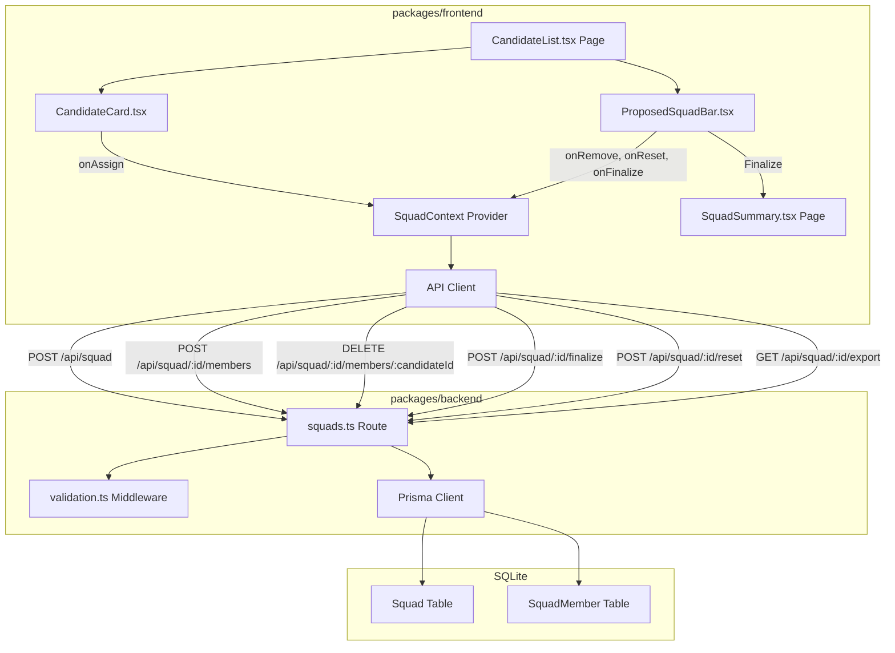
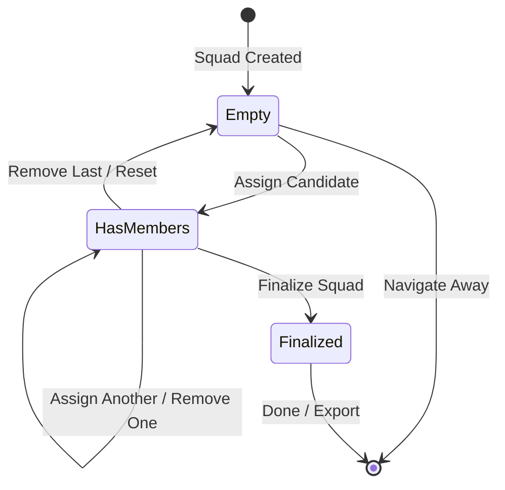
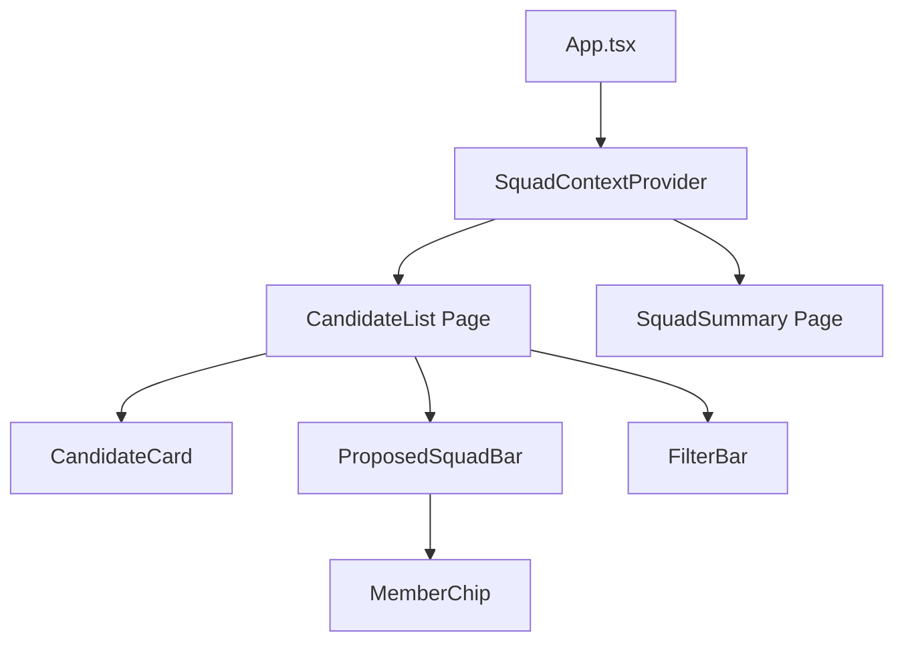

# DESIGN — Feature 8: Proposed Squad Builder

## Overview

The Proposed Squad Builder enables delivery leads to assemble a cross-functional squad by selecting candidates from the ranked recommendation list and managing them through a persistent sticky footer tray. It supports the full lifecycle from assignment through finalization or reset, with a JSON export capability.

### Key Design Decisions

| Decision | Choice | Rationale |
|----------|--------|-----------|
| State management | `useReducer` within `SquadContext` | Squad state is shared across CandidateCard, ProposedSquadBar, and SquadSummary — reducer pattern handles multiple action types cleanly |
| Duplicate prevention | Client-side `candidateId` check + backend 400 response | Fast UI feedback via `isAssigned` prop; backend enforces as safety net |
| Sticky footer pattern | `fixed bottom-0` with `bg-slate-800` | Always visible during candidate browsing; dark surface creates visual separation |
| Export mechanism | Client-side JSON file download via Blob URL | No server-side file generation needed; data already in memory |
| Backend persistence | Squad model in Prisma/SQLite | Enables finalize/reset lifecycle and export by squadId |
| Accessibility | `aria-live="polite"` on footer, keyboard-navigable chips | Dynamic member count updates announced to screen readers |

---

## Architecture



### State Flow



### Request Flow — Assign Candidate

1. User clicks "Assign to Squad" on a `CandidateCard`
2. `SquadContext` reducer checks `squad.some(m => m.candidateId === id)`
3. If duplicate → dispatch `ASSIGN_REJECTED` (no-op, button already disabled)
4. If unique → dispatch `ASSIGN_CANDIDATE` optimistically to update UI
5. API client POSTs to `/api/squad/:squadId/members` with `{ candidateId }`
6. Backend validates no duplicate (returns 400 `DUPLICATE_MEMBER` if exists)
7. On success → state confirmed. On error → dispatch `ROLLBACK_ASSIGN`

---

## Components and Interfaces

### Component Hierarchy



### ProposedSquadBar (`packages/frontend/src/components/ProposedSquadBar.tsx`)

The sticky footer tray displaying assigned squad members.

```ts
interface ProposedSquadBarProps {
  squad: ScoredCandidate[];
  onRemove: (candidateId: string) => void;
  onReset: () => void;
  onFinalize: () => void;
  onExport: () => void;
}

export const ProposedSquadBar: ({ squad, onRemove, onReset, onFinalize, onExport }: ProposedSquadBarProps) => JSX.Element;
```

**Layout:** `fixed bottom-0 left-0 right-0 h-16 bg-slate-800 px-6`
**Visibility:** Always rendered when on CandidateList page; collapses gracefully when empty (shows "No members selected" text).

### MemberChip (internal to ProposedSquadBar)

```ts
interface MemberChipProps {
  candidate: ScoredCandidate;
  onRemove: (candidateId: string) => void;
}
```

Renders: avatar thumbnail + name + dismiss (×) button with `aria-label="Remove {name}"`.

### CandidateCard — Assignment Integration

The existing `CandidateCard` receives an `isAssigned` boolean prop. When `true`:
- "Assign to Squad" button is disabled with `bg-slate-300 text-slate-500 cursor-not-allowed`
- Button text changes to "Assigned"

```ts
interface CandidateCardProps {
  candidate: ScoredCandidate;
  isAssigned: boolean;
  onAssign: (candidateId: string) => void;
  onViewBreakdown: (candidateId: string) => void;
}
```

### SquadSummary Page (`packages/frontend/src/pages/SquadSummary.tsx`)

Confirmation view after finalization. Displays project metadata, squad members table, and export/done actions.

```ts
interface SquadSummaryPageState {
  squadId: string;
  projectCode: string;
  squadIntent: string;
  squadMembers: Array<{
    candidateId: string;
    name: string;
    primaryRole: string;
    sTotal: number;
  }>;
  status: 'finalized';
}
```

### SquadContext + useReducer

```ts
// packages/frontend/src/context/SquadContext.tsx

interface SquadState {
  squadId: string | null;
  squad: ScoredCandidate[];
  filledSeats: number;
  status: 'draft' | 'finalized';
}

type SquadAction =
  | { type: 'SET_SQUAD_ID'; payload: string }
  | { type: 'ASSIGN_CANDIDATE'; payload: ScoredCandidate }
  | { type: 'REMOVE_CANDIDATE'; payload: { candidateId: string } }
  | { type: 'RESET_SQUAD' }
  | { type: 'FINALIZE_SQUAD'; payload: { squadMembers: ScoredCandidate[] } }
  | { type: 'ROLLBACK_ASSIGN'; payload: { candidateId: string } };

const squadReducer = (state: SquadState, action: SquadAction): SquadState => {
  switch (action.type) {
    case 'SET_SQUAD_ID':
      return { ...state, squadId: action.payload };
    case 'ASSIGN_CANDIDATE': {
      const isDuplicate = state.squad.some(
        (m) => m.candidateId === action.payload.candidateId
      );
      if (isDuplicate) return state;
      const newSquad = [...state.squad, action.payload];
      return { ...state, squad: newSquad, filledSeats: newSquad.length };
    }
    case 'REMOVE_CANDIDATE': {
      const filtered = state.squad.filter(
        (m) => m.candidateId !== action.payload.candidateId
      );
      return { ...state, squad: filtered, filledSeats: filtered.length };
    }
    case 'RESET_SQUAD':
      return { ...state, squad: [], filledSeats: 0, status: 'draft' };
    case 'FINALIZE_SQUAD':
      return { ...state, status: 'finalized' };
    case 'ROLLBACK_ASSIGN': {
      const rolledBack = state.squad.filter(
        (m) => m.candidateId !== action.payload.candidateId
      );
      return { ...state, squad: rolledBack, filledSeats: rolledBack.length };
    }
    default:
      return state;
  }
};
```

### API Client Functions (`packages/frontend/src/api/client.ts`)

```ts
export const createSquad = async (demandId: string): Promise<{ squadId: string }> => { ... };
export const assignMember = async (squadId: string, candidateId: string): Promise<{ filledSeats: number }> => { ... };
export const removeMember = async (squadId: string, candidateId: string): Promise<{ filledSeats: number }> => { ... };
export const finalizeSquad = async (squadId: string): Promise<FinalizedSquadResponse> => { ... };
export const resetSquad = async (squadId: string): Promise<void> => { ... };
export const exportSquad = async (squadId: string): Promise<SquadExportData> => { ... };
```

### Backend Route (`packages/backend/src/routes/squads.ts`)

| Method | Path | Handler | Description |
|--------|------|---------|-------------|
| POST | `/api/squad` | `createSquad` | Create draft squad for a demand |
| POST | `/api/squad/:squadId/members` | `assignMember` | Add candidate (reject duplicate) |
| DELETE | `/api/squad/:squadId/members/:candidateId` | `removeMember` | Remove candidate |
| POST | `/api/squad/:squadId/finalize` | `finalizeSquad` | Lock squad, return summary |
| POST | `/api/squad/:squadId/reset` | `resetSquad` | Clear all members |
| GET | `/api/squad/:squadId/export` | `exportSquad` | Return JSON export payload |

---

## Data Models

### Prisma Schema Additions

```prisma
model Squad {
  id        String        @id @default(uuid())
  demandId  String
  status    String        @default("draft") // "draft" | "finalized"
  createdAt DateTime      @default(now())
  updatedAt DateTime      @updatedAt
  members   SquadMember[]
}

model SquadMember {
  id          String   @id @default(uuid())
  squadId     String
  candidateId String
  name        String
  primaryRole String
  sTotal      Float
  createdAt   DateTime @default(now())
  squad       Squad    @relation(fields: [squadId], references: [id])

  @@unique([squadId, candidateId])
}
```

The `@@unique([squadId, candidateId])` constraint enforces duplicate prevention at the database level.

### TypeScript Interfaces

```ts
// Extends from Feature 5 ScoredCandidate
interface ScoredCandidate {
  candidateId: string;
  name: string;
  primaryRole: string;
  skills: { name: string; level: number }[];
  currentAllocationPercentage: number;
  availabilityLabel: 'Available Now' | 'Partial Capacity' | 'Limited Capacity';
  sSkill: number;
  sAvail: number;
  sRole: number;
  sTotal: number;
}

interface SquadExportData {
  projectCode: string;
  squadIntent: string;
  filledSeats: number;
  squadMembers: Array<{
    candidateId: string;
    name: string;
    primaryRole: string;
    sTotal: number;
  }>;
}

interface FinalizedSquadResponse {
  squadId: string;
  status: 'finalized';
  squadMembers: Array<{
    candidateId: string;
    name: string;
    primaryRole: string;
    sTotal: number;
  }>;
}
```

### Zod Validation Schemas (Backend)

```ts
const CreateSquadSchema = z.object({
  demandId: z.string().min(1),
});

const AssignMemberSchema = z.object({
  candidateId: z.string().min(1),
});
```

---


## Correctness Properties

*A property is a characteristic or behavior that should hold true across all valid executions of a system — essentially, a formal statement about what the system should do. Properties serve as the bridge between human-readable specifications and machine-verifiable correctness guarantees.*

### Property 1: Assignment Idempotence

*For any* squad state and any candidate, assigning that candidate (whether they are already in the squad or not) SHALL result in exactly one instance of that candidateId in the squad. Assigning a candidate already present SHALL not change the squad state.

**Validates: Requirements 8.1, 8.2**

### Property 2: Removal Eliminates Candidate

*For any* squad state containing at least one member, removing a candidate by candidateId SHALL produce a squad that does not contain that candidateId and has length exactly one less than the original.

**Validates: Requirements 8.4**

### Property 3: FilledSeats Invariant

*For any* sequence of ASSIGN_CANDIDATE, REMOVE_CANDIDATE, and RESET_SQUAD actions applied to an initial squad state, the `filledSeats` value SHALL always equal `squad.length` after each action.

**Validates: Requirements 8.5**

### Property 4: Reset Clears All State

*For any* squad state (regardless of member count or status), dispatching RESET_SQUAD SHALL produce a state where `squad` is an empty array, `filledSeats` is 0, and `status` is `'draft'`.

**Validates: Requirements 8.8**

### Property 5: Finalize Returns Exact Squad Members

*For any* squad state with at least one member, finalizing SHALL produce a response containing exactly the same set of candidateIds that were present in the squad at the time of finalization.

**Validates: Requirements 8.7**

### Property 6: Footer Renders All Assigned Members

*For any* non-empty squad array passed to ProposedSquadBar, the rendered output SHALL contain the name of every candidate in the squad.

**Validates: Requirements 8.3**

### Property 7: Action Buttons Enabled When Squad Non-Empty

*For any* squad state, the finalize, reset, and export buttons SHALL be enabled if and only if `squad.length >= 1`. When `squad.length === 0`, all three actions SHALL be disabled.

**Validates: Requirements 8.6**

---

## Error Handling

### Frontend Errors

| Scenario | Handling | User Feedback |
|----------|----------|---------------|
| Duplicate assignment attempt | Prevent at reducer level; button already disabled via `isAssigned` | Button shows "Assigned" in disabled state |
| Network error on assign | Catch in API client, rollback optimistic update | Toast: "Failed to assign candidate. Please try again." |
| Network error on remove | Catch in API client, rollback removal | Toast: "Failed to remove candidate. Please try again." |
| Network error on finalize | Catch in API client, remain on current page | Toast: "Failed to finalize squad. Please try again." |
| Network error on reset | Catch in API client, restore previous state | Toast: "Failed to reset squad. Please try again." |
| Network error on export | Catch in API client | Toast: "Failed to export squad summary." |
| Empty squad finalize attempt | Button disabled; action not dispatched | Button visually disabled with `cursor-not-allowed` |

### Backend Errors

| Scenario | HTTP Status | Error Code | Response |
|----------|------------|------------|----------|
| Duplicate member assignment | 400 | `DUPLICATE_MEMBER` | `{ error: { code: "DUPLICATE_MEMBER", message: "Candidate already assigned to squad" } }` |
| Empty squad finalize | 400 | `EMPTY_SQUAD` | `{ error: { code: "EMPTY_SQUAD", message: "Cannot finalize an empty squad" } }` |
| Squad not found | 404 | `NOT_FOUND` | `{ error: { code: "NOT_FOUND", message: "Squad not found" } }` |
| Candidate not in squad | 404 | `NOT_FOUND` | `{ error: { code: "NOT_FOUND", message: "Candidate not found in squad" } }` |
| Invalid request body | 400 | `VALIDATION_FAILED` | `{ error: { code: "VALIDATION_FAILED", message: "<Zod error details>" } }` |
| Database error | 500 | `INTERNAL_ERROR` | `{ error: { code: "INTERNAL_ERROR", message: "An unexpected error occurred" } }` |

### Error Propagation

Errors from Prisma (e.g., unique constraint violation on `@@unique([squadId, candidateId])`) are caught in route handlers and mapped to the appropriate `DUPLICATE_MEMBER` error code. All unhandled errors propagate to the global error handler middleware.

---

## Testing Strategy

### Unit Tests (Vitest)

| Component | What to Test | Approach |
|-----------|-------------|----------|
| `squadReducer` | All action types, state transitions | Property-based tests (Properties 1–4) + example-based for edge cases |
| `ProposedSquadBar` | Rendering members, button states | Property-based tests (Properties 6, 7) + example-based for empty state |
| `squads.ts` route handlers | CRUD operations, error responses | Example-based with mocked Prisma |
| `export-squad.ts` | JSON export format | Example-based with known inputs |
| API client functions | Request/response mapping | Example-based with mocked fetch |

### Property-Based Tests (Vitest + fast-check)

The project uses **fast-check** as the property-based testing library.

**Configuration:**
- Minimum 100 iterations per property test (`{ numRuns: 100 }`)
- Each property test references its design document property via tag comment

**Generators needed:**

```ts
// Arbitrary ScoredCandidate generator
const arbScoredCandidate = (): fc.Arbitrary<ScoredCandidate> =>
  fc.record({
    candidateId: fc.uuid(),
    name: fc.string({ minLength: 1, maxLength: 50 }),
    primaryRole: fc.constantFrom('Frontend Engineer', 'Backend Engineer', 'Product Owner', 'UI/UX Designer'),
    skills: fc.array(fc.record({ name: fc.string({ minLength: 1 }), level: fc.integer({ min: 1, max: 5 }) }), { minLength: 1, maxLength: 5 }),
    currentAllocationPercentage: fc.integer({ min: 0, max: 100 }),
    availabilityLabel: fc.constantFrom('Available Now', 'Partial Capacity', 'Limited Capacity'),
    sSkill: fc.float({ min: 0, max: 100 }),
    sAvail: fc.constantFrom(20, 70, 100),
    sRole: fc.constantFrom(0, 100),
    sTotal: fc.float({ min: 0, max: 100 }),
  });

// Arbitrary squad state generator
const arbSquadState = (): fc.Arbitrary<SquadState> =>
  fc.array(arbScoredCandidate(), { maxLength: 10 }).map((members) => ({
    squadId: 'SQ-TEST',
    squad: members,
    filledSeats: members.length,
    status: 'draft' as const,
  }));
```

**Property test implementation plan:**

```ts
// Feature: feature-8-proposed-squad-builder, Property 1: Assignment Idempotence
fc.assert(fc.property(
  arbSquadState(),
  arbScoredCandidate(),
  (state, candidate) => {
    const afterFirst = squadReducer(state, { type: 'ASSIGN_CANDIDATE', payload: candidate });
    const afterSecond = squadReducer(afterFirst, { type: 'ASSIGN_CANDIDATE', payload: candidate });
    // Exactly one instance after any number of assignments
    const count = afterSecond.squad.filter(m => m.candidateId === candidate.candidateId).length;
    expect(count).toBeLessThanOrEqual(1);
    // Second assignment is no-op
    expect(afterSecond).toEqual(afterFirst);
  }
), { numRuns: 100 });
```

### Integration Tests

| Test | What to Verify |
|------|---------------|
| POST `/api/squad` | Creates squad record, returns squadId |
| POST `/api/squad/:id/members` | Adds member, returns updated filledSeats |
| POST `/api/squad/:id/members` (duplicate) | Returns 400 DUPLICATE_MEMBER |
| DELETE `/api/squad/:id/members/:candidateId` | Removes member, returns updated filledSeats |
| POST `/api/squad/:id/finalize` | Sets status to finalized, returns member list |
| POST `/api/squad/:id/reset` | Clears members, returns filledSeats: 0 |
| GET `/api/squad/:id/export` | Returns complete squad summary JSON |

### E2E Tests (Playwright)

| Test | Journey |
|------|---------|
| Assign candidate | Click "Assign to Squad" → verify chip appears in footer |
| Duplicate prevention | Assign same candidate twice → verify button disabled after first |
| Remove candidate | Click × on chip → verify chip removed, button re-enabled |
| Finalize flow | Assign 2 candidates → click Finalize → verify SquadSummary page |
| Reset flow | Assign candidates → click Reset → confirm → verify empty footer |
| Export | Finalize squad → click Export → verify JSON download |

### Test File Locations

```
packages/frontend/src/context/SquadContext.test.ts          ← Property tests (Properties 1–5)
packages/frontend/src/components/ProposedSquadBar.test.tsx   ← Property tests (Properties 6, 7)
packages/backend/src/routes/squads.test.ts                  ← Integration tests
packages/frontend/e2e/squad-builder.spec.ts                 ← E2E tests
```
