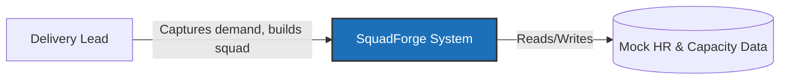
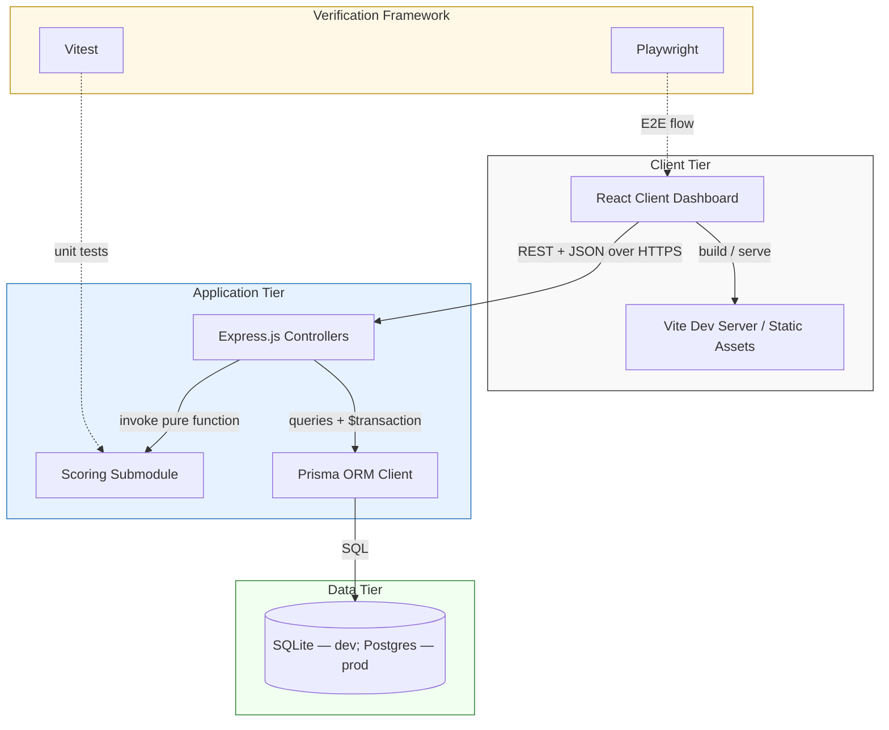
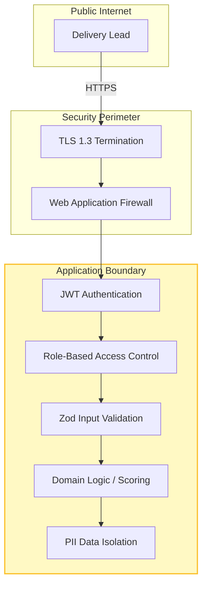
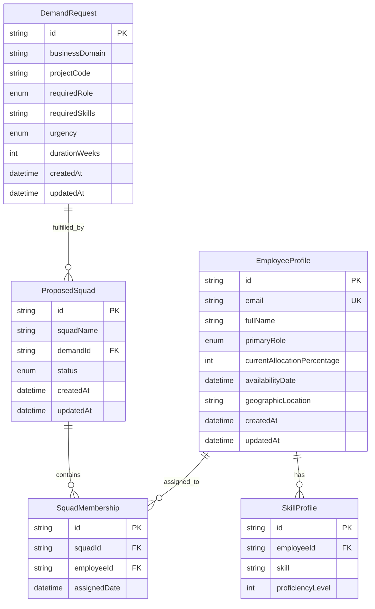
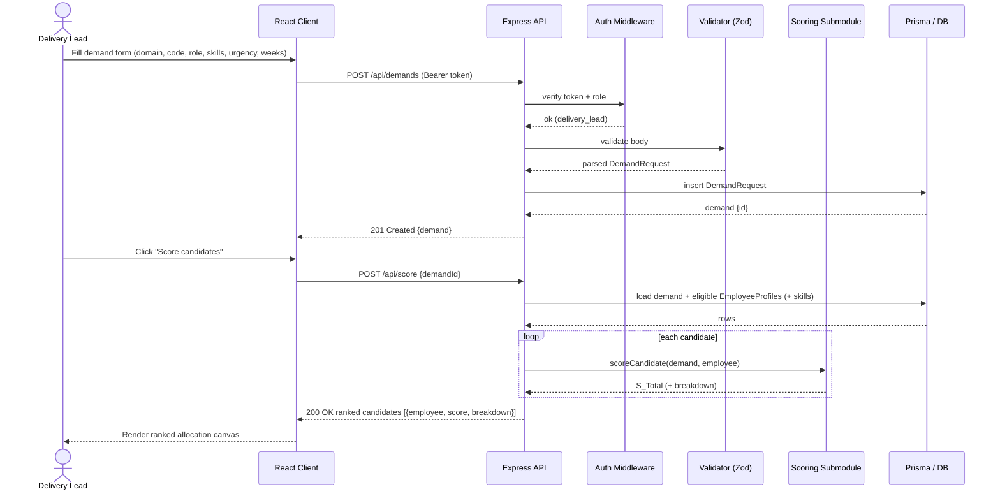
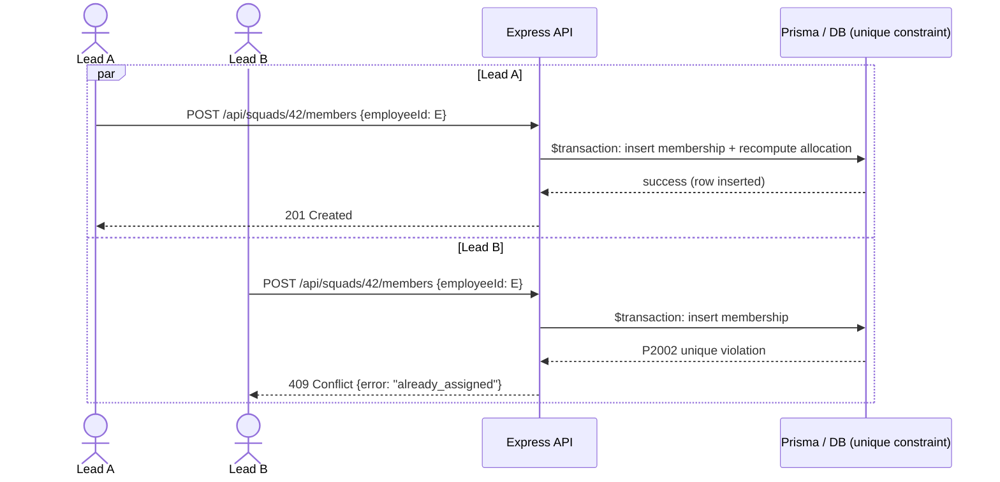
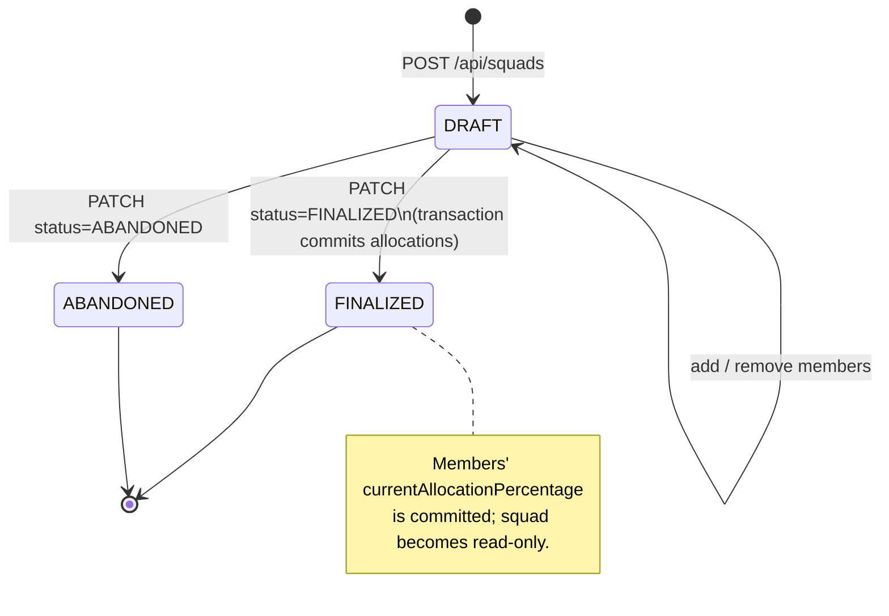

# Architecture Document: SquadForge

---

## 1. Purpose & Scope

SquadForge helps a delivery lead assemble a project squad: capture a **demand** (goal, required role/skill, urgency, duration), score available **employees** against that demand with a transparent deterministic formula, and assemble a **proposed squad** that can be reviewed and finalized.

The deterministic (non-AI) scoring constraint is a hard requirement: results must be explainable and reproducible for audit.

---

## 2. Architecture Views

To provide a complete architectural picture, the following views represent different levels of the system: from context and logic to physical deployment and security.

### 2.1 System Context (C4 Level 1)
Defines the system boundary and its interactions with external actors and simulated systems.



### 2.2 Component Interaction Topology (C4 Level 2)
Details the internal components and their interactions within the SquadForge boundary.



### 2.3 Physical Deployment View
Represents how the components are distributed across physical or virtual infrastructure.

```mermaid
graph TD
    subgraph Local_Dev ["Local Development Environment"]
        Vite[Vite Dev Server :5173] -->|Proxies /api| Node[Node.js Runtime :3001]
        Node -->|Local File I/O| SQLite[(squadforge.db)]
    end

    subgraph Production ["Production Environment (Target)"]
        CDN[CDN / Web Server] -->|Serves Static Assets| Browser[User Browser]
        Browser -->|HTTPS| ALB[Load Balancer / Reverse Proxy]
        ALB -->|TLS Termination| AppSrv[App Server Cluster]
        AppSrv -->|Express.js| RDS[(Managed PostgreSQL)]
    end

    style Local_Dev fill:#f5f5f5,stroke:#333,stroke-dasharray:5 5
    style Production fill:#e1f5fe,stroke:#01579b
```



### 2.4 Security Architecture
Visualizes the security boundaries and controls applied to the system.



---

## 3. Components

The React/Vite/Tailwind client, the Express/TypeScript API skeleton, the Prisma client, and the Vitest+Playwright harness all ship today (the starter). The demand/allocation UI, the scoring submodule, and the domain routes are proposed.

- **Frontend (React + Vite + Tailwind CSS)** — Single-page app for the demand-capture forms and the squad-allocation view. State is held client-side and synchronized with the API over `fetch`. *(shell; domain screens.)*
- **API Layer (Express.js + TypeScript)** — HTTP service exposing the domain endpoints in §6. Stateless per request (no server-side session); all durable state lives in the database. *(skeleton + middleware; domain routes.)*
- **Data Access Layer (Prisma ORM)** — Typed database client. The transaction safety claimed for squad provisioning is delivered by explicit `prisma.$transaction(...)` scopes (§8), not by Prisma defaults. *(client wired; domain schema.)*
- **Scoring Submodule** — A pure function `scoreCandidate(demand, employee): number` with no I/O, living in `server/src/services/scoring.ts`, invoked by the API. Pure so it is unit-testable in isolation and deterministic. *(proposed.)*
- **Test Suite (Vitest + Playwright)** — Vitest unit tests target the scoring function's boundaries; Playwright drives the demand→score→allocate→finalize flow end-to-end. *(harness; domain tests.)*

---

## 3. Data Model

The current shipped schema (`server/prisma/schema.prisma`) contains **only** a placeholder `User` model. The model below is the **proposed** replacement.

Design choices applied from review:
- A relational **`SkillProfile`** table replaces the opaque `skills Json` blob, so the 50%-weighted skill match is indexable and the matching rule is expressible in SQL.
- An explicit **`DemandRequest ↔ ProposedSquad`** foreign key (each squad fulfills one demand; a demand may have several draft squads) closes the missing link in the core flow.
- **`@@unique([squadId, employeeId])`** on the join table is the actual mechanism that prevents double-assignment (§8) — the join table alone does not.
- `createdAt`/`updatedAt` on every entity; `updatedAt` doubles as the optimistic-lock token.
- `currentAllocationPercentage` is treated as a **cached projection** of active memberships, recomputed on assignment within a transaction (§8) — never edited directly.

### 3.1 Proposed Prisma schema

```prisma
enum Role     { FRONTEND BACKEND FULLSTACK DESIGN QA DATA PLATFORM }
enum Urgency  { LOW MEDIUM HIGH CRITICAL }
enum SquadStatus { DRAFT FINALIZED ABANDONED }

model DemandRequest {
  id            String   @id @default(uuid())
  businessDomain String
  projectCode   String
  requiredRole  Role
  requiredSkills String   // Comma-separated or JSON if using Postgres, but for SQLite simple string is fine for now
  urgency       Urgency
  durationWeeks Int
  squads        ProposedSquad[]
  createdAt     DateTime @default(now())
  updatedAt     DateTime @updatedAt
}

model EmployeeProfile {
  id                          String   @id @default(uuid())
  email                       String   @unique          // stable identity key
  fullName                    String
  primaryRole                 Role
  currentAllocationPercentage Int      @default(0)       // cached; see §8
  availabilityDate            DateTime
  geographicLocation          String
  skills                      SkillProfile[]
  memberships                 SquadMembership[]
  createdAt                   DateTime @default(now())
  updatedAt                   DateTime @updatedAt
}

model SkillProfile {
  id               String          @id @default(uuid())
  employee         EmployeeProfile @relation(fields: [employeeId], references: [id], onDelete: Cascade)
  employeeId       String
  skill            String
  proficiencyLevel Int                                   // 1..5, validated at API
  @@unique([employeeId, skill])
  @@index([skill])
}

model ProposedSquad {
  id           String           @id @default(uuid())
  squadName    String
  demand       DemandRequest    @relation(fields: [demandId], references: [id], onDelete: Restrict)
  demandId     String
  status       SquadStatus      @default(DRAFT)
  members      SquadMembership[]
  createdAt    DateTime         @default(now())
  updatedAt    DateTime         @updatedAt
}

model SquadMembership {
  id          String          @id @default(uuid())
  squad       ProposedSquad   @relation(fields: [squadId], references: [id], onDelete: Cascade)
  squadId     String
  employee    EmployeeProfile @relation(fields: [employeeId], references: [id], onDelete: Restrict)
  employeeId  String
  assignedDate DateTime       @default(now())
  @@unique([squadId, employeeId])                        // prevents double-assignment
  @@index([employeeId])
}
```

### 3.2 Entity Relationship Diagram



---

## 4. Scoring Specification

**Location:** `server/src/services/scoring.ts` — a pure function, no database access, no clock reads passed implicitly (the demand's reference date is passed in).

**Formula:**

$$S_{\text{Total}} = 0.50 \cdot S_{\text{Skill}} + 0.30 \cdot S_{\text{Avail}} + 0.20 \cdot S_{\text{Role}}$$

Each sub-score is normalized to `[0, 1]`, so `S_Total ∈ [0, 1]`.

| Sub-score | Definition | Rule |
| --- | --- | --- |
| `S_Skill` | Skill match | Look up candidate's proficiency for each requested skill in `SkillProfile`. Score is `1.0` for levels 4-5, `reduced` for <4, and `0` if absent. `S_Skill` is the **average** across all requested skills (REQ-6.2-6.6). |
| `S_Avail` | Spare capacity | Bracket-based: `1.0` if allocation is 0%; `0.7` if 1-50%; `0.2` if >50% (REQ-6.7-6.9). |
| `S_Role` | Role fit | `1.0` if `primaryRole == requiredRole`; else `0.5` (REQ-6.10-6.11). |

**Weight provenance:** the 0.50 / 0.30 / 0.20 split is a **placeholder pending sign-off from the delivery-lead stakeholder**; it is config, not a constant baked into logic — store it in `scoring.config.ts` so a weight change is a one-line edit with a test, not a code hunt. *(This dependency is flagged because the doc previously claimed auditability without naming a source.)*

**Failure modes (must be handled and tested):**
- **No eligible candidate** (all `S_Total == 0`) → API returns an empty ranked list with `reason: "no_eligible_candidates"`, not an error.
- **All candidates at 100% allocation** → `S_Avail == 0` for all; ranking falls back to skill+role ordering and the response flags `capacityWarning: true`.
- **Ties** → break deterministically by earliest `availabilityDate`, then by `id` (so ordering is reproducible — required for audit).

**Verification (Vitest):** boundary cases — proficiency 0 and 5, allocation 0 and 100, exact/adjacent/no role match, the tie-break ordering, and that the three weights sum to 1.0.

---

## 5. Request Flows (Sequence & State)

These flows realize the SquadForge domain. The starter baseline they build on is health/error behavior (`requirements.md` REQ-2.5 CORS, REQ-2.6 error middleware). **Domain requirements (demand capture, scoring, allocation) are not yet captured in `requirements.md` — see §10 traceability gap.**

### 5.1 Demand capture → scoring



### 5.2 Concurrent squad assembly (race-condition handling)

> Two delivery leads try to add the **same** employee to the same squad at nearly the same time. The `@@unique([squadId, employeeId])` constraint plus a transaction guarantees exactly one wins.



### 5.3 ProposedSquad lifecycle (state)



---

## 6. Domain API Contract

Only the starter routes exist (`/health`, `/api/health`, `/api/info`, `/api/echo`). The endpoints below are proposed and supersede the User-CRUD placeholders previously listed in `api-spec.md`. All write endpoints require auth (§7) and Zod validation; all can return `400` (validation), `401`/`403` (auth), `404`, `409` (conflict), `422` (unprocessable).

| Method | Path | Body / Params | Success | Notable errors |
| --- | --- | --- | --- | --- |
| `POST` | `/api/demands` | DemandRequest fields | `201 {demand}` | `400`, `403` |
| `GET` | `/api/demands/:id` | — | `200 {demand}` | `404` |
| `GET` | `/api/employees` | `?role&availableBy&skill` | `200 {employees[]}` | `400` |
| `POST` | `/api/score` | `{demandId}` | `200 {ranked[]}` | `404` (demand) |
| `POST` | `/api/squads` | `{demandId, squadName}` | `201 {squad}` | `400`, `404` |
| `GET` | `/api/squads/:id` | — | `200 {squad, members}` | `404` |
| `POST` | `/api/squads/:id/members` | `{employeeId}` | `201 {membership}` | `409` (already assigned / over capacity) |
| `DELETE` | `/api/squads/:id/members/:employeeId` | — | `204` | `404` |
| `PATCH` | `/api/squads/:id/status` | `{status}` | `200 {squad}` | `409` (illegal transition) |

**Error envelope** (uniform, via the existing error middleware — REQ-2.6):

```json
{ "error": "already_assigned", "message": "Employee is already a member of this squad.", "status": 409 }
```

---

## 7. Security

The starter is intentionally open (`Auth: none`, permissive CORS — REQ-2.5). The following are **required before any domain endpoint ships**, because the system holds employee PII and controls allocation decisions.

- **AuthN/AuthZ:** Bearer-token auth (JWT) on all `/api/*` domain routes; role-based access — only `delivery_lead` may create demands, score, and finalize. Replaces the doc's earlier unbacked "Secure REST Requests" claim.
- **Input validation:** Zod (or Joi) schema per write endpoint; reject with `400` before any DB call. `express.json()` alone is not validation.
- **CORS:** explicit origin allow-list in production (not the permissive starter default).
- **PII:** `EmployeeProfile.fullName` and `geographicLocation` are personal data. Restrict reads to authorized roles, exclude from logs, and document retention. No plaintext PII in error responses.
- **Transport:** HTTPS in production (TLS terminated at the proxy/host).

---

## 8. Concurrency & Data Integrity

The earlier claim that the join table "eliminates race-conditions" and "guarantees integrity" is only true with the mechanisms below — named here concretely:

- **Uniqueness:** `@@unique([squadId, employeeId])` makes a duplicate insert fail at the database (Prisma error `P2002`), surfaced as `409`. This is the actual guard, not the existence of the join table.
- **Transactions:** member add/remove and finalize run inside `prisma.$transaction([...])` so the membership row and the recomputed `currentAllocationPercentage` commit atomically.
- **Allocation is derived:** on each membership change, recompute `currentAllocationPercentage` from active memberships within the same transaction — never trust a stored value to be edited in place (avoids the lost-update problem the panel flagged).
- **Optimistic locking:** use `updatedAt` as a version token on `PATCH /squads/:id/status` to reject stale writes.
- **SQLite reality (dev):** SQLite is single-writer; enable WAL mode and keep transactions short. For real concurrency, the production datasource is **PostgreSQL** (`datasource db` swapped via `DATABASE_URL`).
- **Required test:** two concurrent `POST /members` for the same employee ⇒ exactly one `201`, one `409` (the Playwright/integration assertion that backs the concurrency claim).

---

## 9. Integrations

Both integrations are **simulated locally** — there is no live enterprise connection. Stated plainly (the previous "ephemeral lookup layer" wording is removed):

- **HR Core (simulated via Prisma seed):** a `prisma/seed.ts` script populates `EmployeeProfile` + `SkillProfile` with sample multi-skilled engineers so scoring can run without a real HR system. "Seed data," not a runtime service.
- **Capacity lookup (simulated):** spare capacity is computed locally from `currentAllocationPercentage` (§8) instead of calling a remote corporate directory. A real directory integration would replace this read.

---

## 10. Key Decisions

### 1. Deterministic weighted-sum scoring (no AI/ML)
- **Decision:** a pure linear weighted sum (§4) in an isolated Node function.
- **Rationale:** compliance and auditability require explainable, reproducible results; black-box models are excluded by organizational constraint. *Substantiated by:* the pure-function design (§2), config-stored weights (§4), and boundary tests.

### 2. Scoring lives in the API tier, not the React view
- **Decision:** the scoring function runs server-side behind `POST /api/score`.
- **Rationale:** separation of concerns and a single network-accessible engine — the same endpoint can later be invoked by an automation/agent workflow. *Substantiated by:* §2 component split and §6 contract. (This is a real decision, distinct from Express/Prisma defaults.)

### 3. Explicit `SquadMembership` join table
- **Decision:** a relational bridge entity, not a JSON array on the squad.
- **Rationale:** enables `@@unique([squadId, employeeId])`, transactional integrity, and per-assignment audit (`assignedDate`). *Substantiated by:* §8 — the guarantee depends on the constraint + transaction, which are now specified, not on the table alone.

---

## 11. Traceability & Gaps

- **Implemented baseline** maps to `requirements.md` REQ-2.1–2.6 (health, echo, CORS, error middleware) and REQ-1.x (tooling).
- **Domain mapping:** The proposed architecture and domain logic map directly to `requirements.md` Features 5–8 (Demand Capture, Scoring, Breakdown, and Squad Builder).
- **Not yet built:** The entire schema in §3, the scoring submodule in §4, the endpoints in §6, the security controls in §7, and the seed in §9. The current repo is the starter only.
